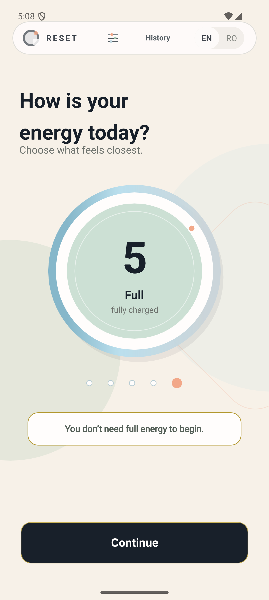
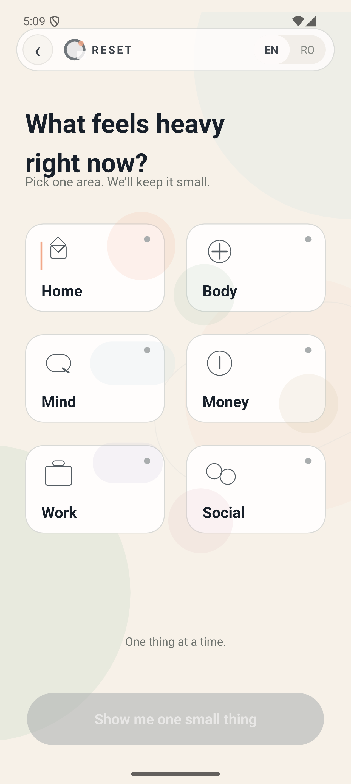
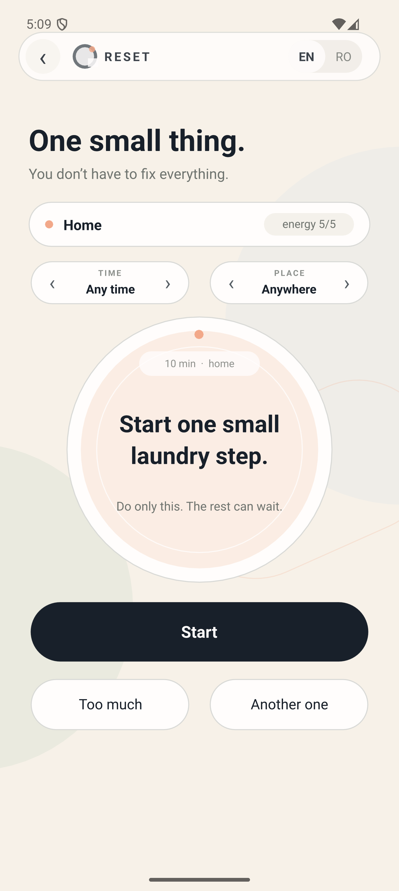
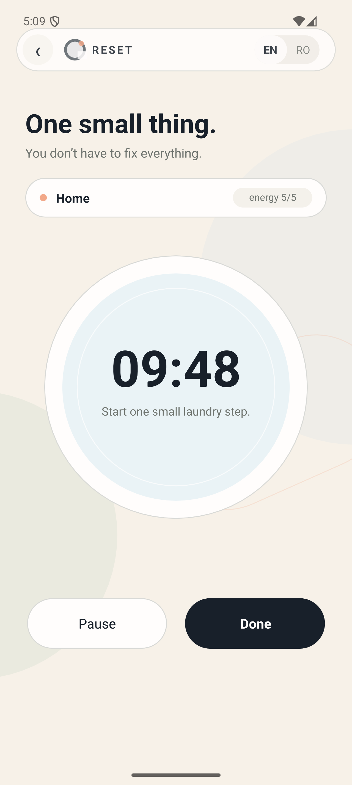
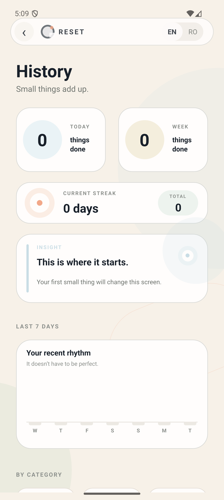

# RESET - Mobile Self-Regulation App

RESET is a bilingual mobile lifestyle app built with Qt/QML.

It helps users choose small, realistic actions based on their current energy level, context, and category. The app is designed as a calm tool for moments when the user feels low-energy, overwhelmed, distracted, or unsure what to do next.

## Features

- Energy check from 1 to 5
- Bilingual interface: English and Romanian
- Category-based suggestions: Home, Body, Mind, Money, Work, Social
- Smart task selection
- Easier task alternative with Too much
- New suggestion with Another one
- Context filters for time and place
- Built-in task timer
- Pause, resume and done flow
- Local history and stats
- Persistent app state between sessions
- Android-ready responsive layout

## Screenshots

  
  
  
  
  

## Tech Stack

- Qt Design Studio
- Qt Creator
- QML
- JavaScript
- CMake
- SQLite / QML LocalStorage
- Android build system

## Platform

The app was tested on Android emulator and exported as a signed Android APK and Android App Bundle.

Release files are not included in this repository.

## Project Structure

- App.qml - main app logic, state and navigation
- Screen01.ui.qml to Screen05.ui.qml - visual screen files
- ActionLibrary.js - task data
- SmartPicker.js - task selection logic
- HistoryStore.js - local history storage
- InsightEngine.js - stats and insights
- CMakeLists.txt - build configuration
- android/ - Android resources

## Design Direction

RESET uses a soft, mature visual identity with an ivory base, sage accents, peach highlights, pale blue details, rounded cards, and a minimal circular logo.

The design goal was to create a mobile app that feels calm, useful, and non-judgmental rather than gamified or overwhelming.

## Status

Version 1.0.0 is functional and Android-ready.

Current status:

- UI complete
- Navigation complete
- Android responsive layout complete
- Local persistence complete
- History storage complete
- Signed APK generated
- AAB generated for Google Play

## Author

Designed and developed by Alina Bratu as part of a mobile UI/UX and Qt/QML portfolio.
